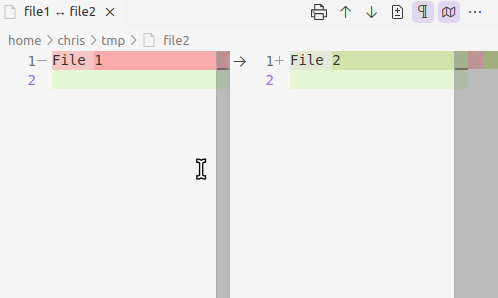

# Inline/Side-by-Side Toggle Button

Adds button on diff editors to toggle between inline and side-by-side view

## Notes

You may want to disable the "Diff Editor: Use Inline View When Space Is Limited" setting.  For more details, see https://code.visualstudio.com/updates/v1_82#_dynamic-layout

## Attributions

[Microsoft Codicons](https://github.com/microsoft/vscode-codicons)
